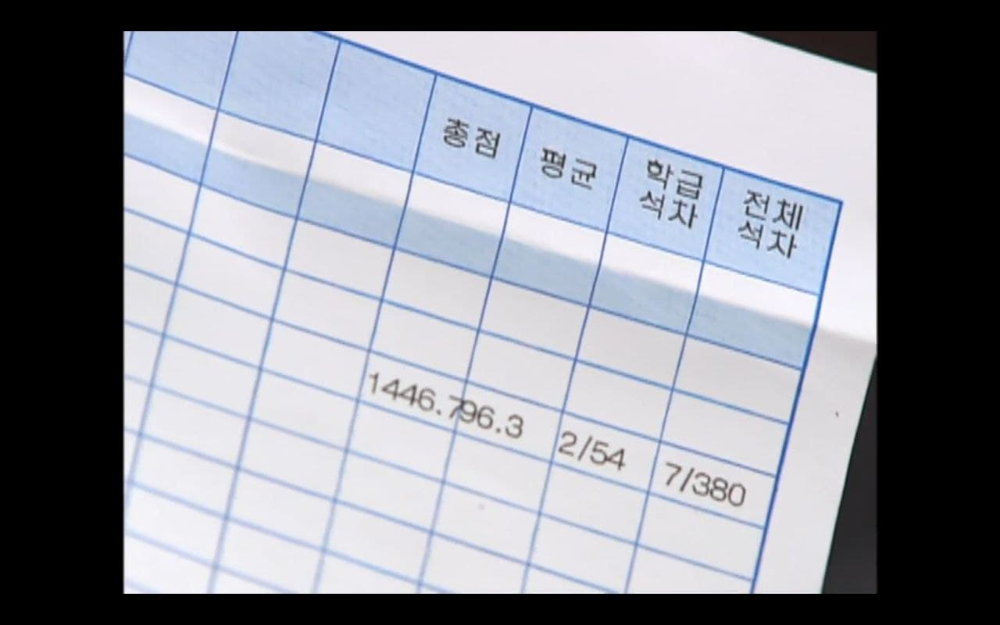
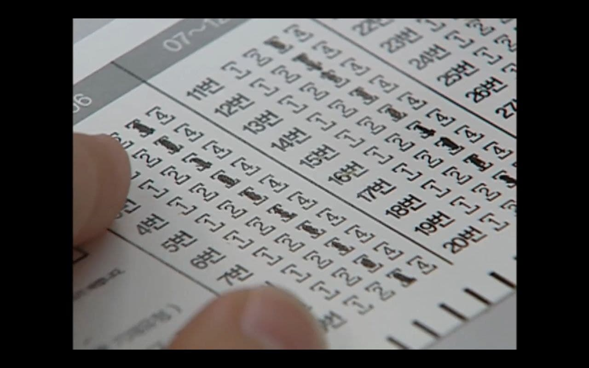
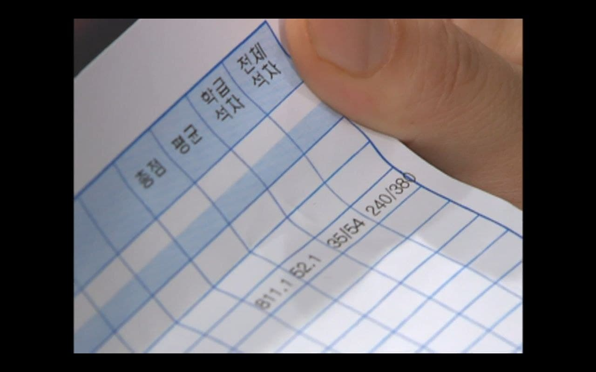

# 거침없이 하이킥! 51회 이민호 성적표를 활용한 풍파고 성적분포의 추정

이 사진은 하이킥 51회에서 이민호가 받은 성적표이다. 이 성적표에서 전교 등수가 떨어졌다고 가족들이 난리가 났던 에피소드. 반면 이윤호는 성적이 아주 많이 올랐는데도 형 이민호 때문에 다들 정신이 없어 몰라줬다. 

이 성적표에 나온 평균점수와 총점수, 전교 등수, 전교 학생 수, 이민호 반 학생 수 등의 숫자를 확인하고 적절한 분포를 통해 하이킥에 등장하는 학교 풍파고등학교 시험 점수의 분포를 추론해보았다.

#

## 전교꼴찌그룹(모든 문제의 정답률이 25%인 그룹) 추정
 
  한반에 2명으로 추정(이민호 반: 황찬성, 염승현, 강유미 반: 강유미, 나혜미)
  
  나무 위키에 따르면 10반이 존재함. 
  
  성적표를 통한 예상 학급수는 전교 인원 380/54=7. ... 이다.
  
  하지만 출연진 외에 전교꼴찌그룹이 반내에 추가로 존재할 가능 성이 있으므로 넉넉잡아 20명으로 추정함.
 
#

## 전교꼴찌아닌그룹 추정
 
  (이윤호 성적표)
  
  전교꼴찌그룹 제외한 360명
  
  고교 선생님들에 따르면 학생들의 성적 분포는 정규분포 두개가 합쳐진 소위 낙타분포를 이룬다고 한다.
  
  정규분포 하나는 많이 맞추는 그룹, 나머지 하나는 거의 못 맞추는 그룹
  
  두 정규분포의 평균값 차이는 시험에 따라 다양하지만, 하이킥의 특성상 매우 극명할 것으로 추정함.
  
  먼저 15과목이라는 점에서 이걸 전부 다 100점을 맞추는 건 매우매우매우 어려울 것으로 생각함.
  
  이민호는 전교 7등, 총점 1446.7점
  
  이윤호는 전교 240등, 총정 811.1점

#

## 두 정규분포의 평균과 표준편차 추정
  먼저 전교꼴찌그룹은 다 찍는다는 가정으로 확률 0.25, 표본수 1500(문제 개수 15과목x약30개)이항분포를 따른다고 추정
  
  중심극한정리에 따라 이 분포는 분산 0.25x0.75x1500, 평균 0.25x1500의 정규분포에 근사할 것임.

#
